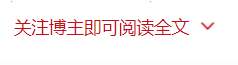

# csdn-extand

**恼人的“关注博主即可阅读全文”**

* **作者：** Nicolas·Lemon
* **修改：** Nicolas·Lemon
* **创建时间：** 2022.04.06
* **修改时间：** 2022.04.06

## 说明

在阅读CSDN的文章时，有的时候，会遇到“关注博主即可阅读全文”的情况，会把正文部分隐藏起来，去除掉部分css样式代码，即可把隐藏的原文展示出来。

